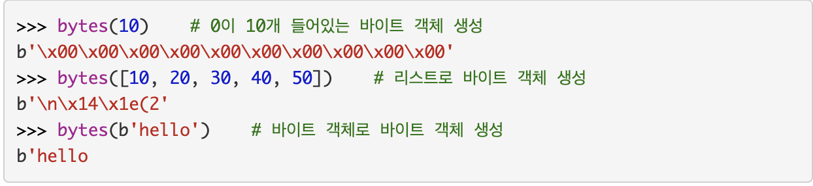

# bytes, str 자료형 조사

bytes
1바이트 단위의 값을 연속적으로 저장하는 시퀀스 자료형이다.
(1바이트는 8비트로 정의하면 0 ~ 255까지 정수를 사용한다.)

bytes로 바이트 객체를 만드는 방법은 3가지가 있다.

- bytes(길이): 정해진 길이만큼 0으로 채워진 바이트 객체를 생성
- bytes(반복가능한객체): 반복 가능한 객체로 바이트 객체를 생성
- bytes(바이트객체): 바이트 객체로 바이트 객체를 생성

영어 한글자는 1바이트
숫자도 1바이트
한글은 보통 2바이트

[참고: 유니코드 파이썬 레페런스 문서](https://docs.python.org/ko/3/howto/unicode.html)

## 유니코드 단점

이식성이 없습니다; 다른 프로세서는 바이트를 다르게 정렬합니다.

이는 공간을 매우 낭비하는 겁니다. 대부분 텍스트에서 주요 코드 포인트는 127 또는 255보다 작으므로 많은 공간이 0x00으로 채워집니다. 위의 문자열은 ASCII 표현에 필요한 6 바이트와 비교하여 24 바이트를 사용합니다. 늘어난 RAM 사용은 중요하지 않지만(데스크톱 컴퓨터는 기가바이트 단위의 RAM을 갖고 있고, 문자열은 대개 그 정도로 크지 않습니다), 디스크와 네트워크 대역폭 사용을 4배로 확장하는 것은 용납할 수 없습니다.

## utf-8 사용

UTF-8은 일반적으로 가장 많이 사용되는 인코딩 중 하나이고, 파이썬은 종종 기본적으로 이것을 사용합니다. UTF는 “Unicode Transformation Format”의 약자이며 ‘8’은 8비트 값이 인코딩에 사용됨을 뜻합니다. (UTF-16과 UTF-32 인코딩도 있지만, UTF-8보다 낮은 빈도로 사용됩니다.) UTF-8은 다음의 규칙을 따릅니다:

만약 코드 포인트가 128보다 작다면, 해당 바이트 값으로 표현됩니다.

만약 코드 포인트가 128보다 크거나 같다면, 시퀀스의 각 바이트가 128에서 255 사이인 둘, 셋 또는 네 개의 바이트 시퀀스로 바뀝니다.

UTF-8은 몇 가지 편리한 특징이 있습니다:

모든 유니코드 코드 포인트를 처리 할 수 있습니다.

유니코드 문자열은 널 문자를 표현하는 곳에만 내장된 0바이트를 포함하는 바이트 시퀀스로 변환됩니다. 이는 UTF-8 문자열을 strcpy()와 같은 C 함수로 처리하고 문자열 끝 표시 이외의 0바이트를 처리하지 못하는 프로토콜을 통해 전송할 수 있음을 의미합니다.

ASCII 텍스트의 문자열 역시 유효한 UTF-8 텍스트입니다.

UTF-8은 꽤 알찹니다; 일반적으로 사용되는 문자 대부분을 한두 개의 바이트로 표현할 수 있습니다.

만약 바이트가 손상 또는 손실되었다면, 다음 UTF-8 인코딩 코드 포인트의 시작을 결정하고 다시 동기화할 수 있습니다. 무작위 8비트 데이터가 유효한 UTF-8처럼 보일 가능성은 낮습니다.

UTF-8은 바이트 지향 인코딩입니다. 인코딩은 각 문자가 하나 이상의 바이트의 특정 시퀀스로 표시되도록 지정합니다. 이렇게 하면 UTF-16과 UTF-32와 같이 바이트의 시퀀스가 문자열이 인코딩된 하드웨어에 따라 달라지는 정수와 워드(word) 지향 인코딩에서 발생할 수 있는 바이트 순서 문제를 피할 수 있습니다.

## 함수

반복되는 것을 하나로 재사용 하는 것이다.

## 클래스

속성과 행동이 있다.

- 함수와 클래스를 구분하는 조건은? class 에서 self, 어트리뷰트 데이터 값을 쓰는 조건에 따라서 달라진다.

## 클로저와 데코레이터

> 클로저

클로저는 함수를 둘러싼 환경 (지역, 변수, 코드 등)을 계속 유지 하다가 함수를 호출 할때 다시 꺼내서 사용하는 함수를 뜻한다. 따라서 클로저는 지역 변수와 코드를 묶어서 사용하고 싶을 때 활용한다.
클로저에 속한 지역 변수는 바깥에서 직접 접근 할 수 없으므로 데이터를 숨기고 싶을 때 활용한다.

> 데코레이터
데코레이터는 장식하다. 꾸미다라는 뜻이다.
함수를 수정하지 않은 상태에서 추가 기능 구현할때 사용한다.

## 이터레이터와 제너레이터

[colab 이터레이터, 제너레이터](https://colab.research.google.com/drive/1uk0QmeHLzZjCzeo3Pht5_kWOsTZAP-qz?usp=sharing)