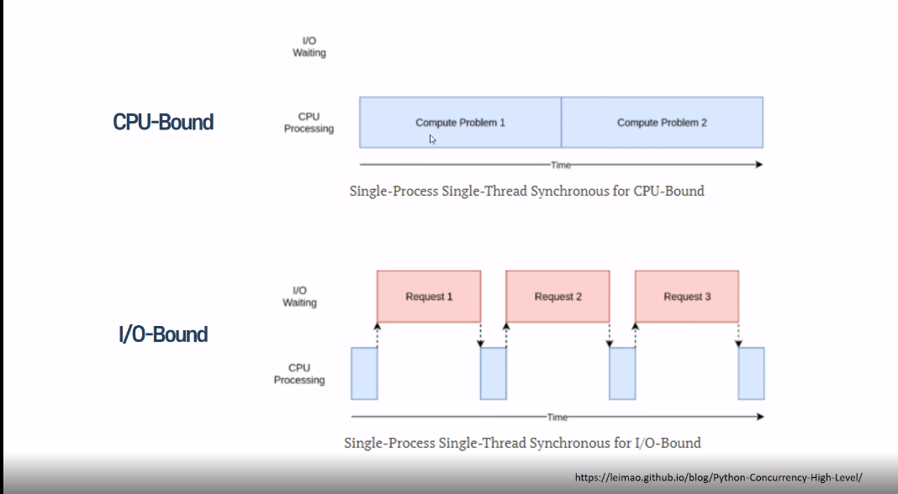

# 과제 설명

cpu bound 연산은 cpu에 의해 제한이 된다.

파이썬에서는 GIL에 의해 멀티스레드로 구현되어도 하나의 스레드로 연산과정이 이루어 진다.
GIL은 Global Interpreter Lock 이다.
파이썬 인터프리터가 한 스레드만 하나의 바이트코드를 실행 시킬수 있도록
Lock으로 제한을 걸어 놓은 것이다.

따라서 하나의 스레드와 멀티스레드는 상황에 따라서 느려질수도 있다.

## 과제 보완

스레드, 멀티스레드, 멀티프로세스, asyncio 한정된 문법만 사용
다양하게 공부가 필요하다. 공부가 좀더 필요하다.

## 4주차 리뷰

    context switching 개념을 해해야한다.
 

> 현재 진행하고 있는 Task (Thread, Process)의 상태를 저장하고 다음 진행할 Task의 상태 값을 읽어 적용하는 과정을 말한다. 

동시성과 병렬성 정리 하기
blocking, nonblocking 차이
 

asyncio 만들어보자
 

재너레이터 , 코루틴
send() 제어권를 넘긴다. 서로 값을 주기도 한다. 하나만 주기도 한다.

이터레이터, 제네레이터, 코루틴, asnycn io, 멀티스레드, 멀티프로세서 (전체적인 흐름을 이어서 공부하자)
 

GIL
> 파이썬에서는 GIL에 의해 멀티스레드로 구현되어도 하나의 스레드로 연산과정이 이루어 진다.
GIL은 Global Interpreter Lock 이다.
파이썬 인터프리터가 한 스레드만 하나의 바이트코드를 실행 시킬수 있도록
Lock으로 제한을 걸어 놓은 것이다.
