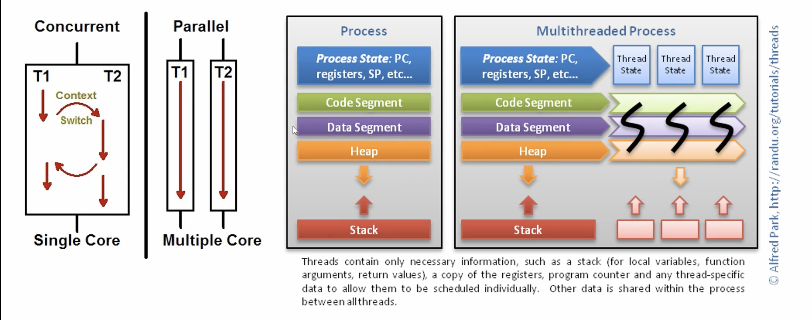

# flab 5주차 리뷰

## 클로저

함수 본체에서 정의하지 않고 참조하는 비전역 변수를 포함한 확장 범위를 가진 함수이다.
함수 본체는 외부에 정의된 비전역 변수에 접근할수 있는 것이 중요하다.

## 코루틴

제너레이터의 호출자는 send()를 이용해서 제너레이터 함수 내부의 yield 표현식의 값이 될 데이터를 
전송할 수 있다. 이렇게 제너레이터가 호출자에 데이터를 생성해주고 호출자로부터 데이터를 받으면서
호출자와 협업하는 프로시저인 코루틴이 된다.

